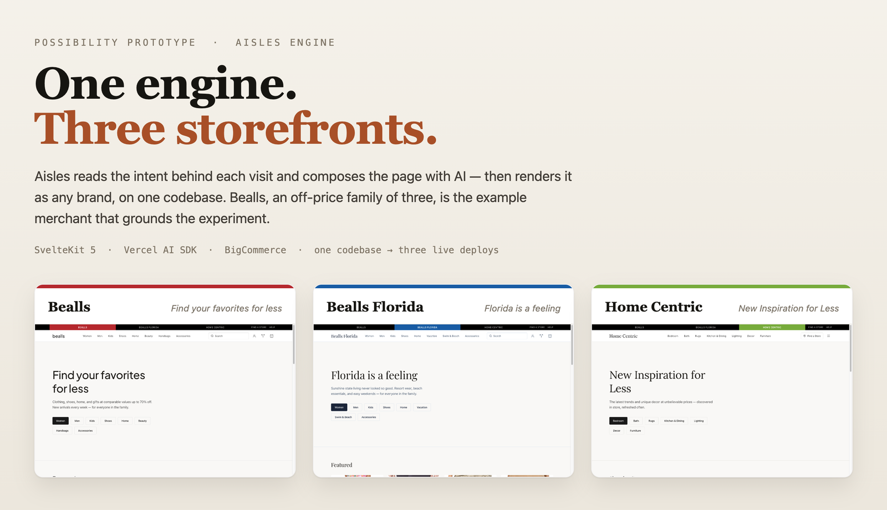

<p align="center">
  
</p>

<h1 align="center">Aisles &mdash; an AI-native storefront, shown as a family of brands</h1>

<p align="center">
  <a href="#what-it-is"><b>What it is</b></a> ·
  <a href="#the-three-layers"><b>Three layers</b></a> ·
  <a href="#how-the-engine-composes-a-page"><b>How it works</b></a> ·
  <a href="#quickstart"><b>Quickstart</b></a> ·
  <a href="#documentation"><b>Docs</b></a>
</p>

> **Example-merchant notice.** Bealls, Bealls Florida, and Home Centric appear here as an **example merchant** — realistic retail properties (off-price, a family of brands, buy-online-pickup-in-store, a content-led home brand) chosen to ground the prototype in something concrete. This is an independent research-and-development experiment. It is **not** affiliated with, endorsed by, or a commercial engagement with Bealls Inc. All product data and imagery are demo content.

---

## What it is

Aisles is a working prototype of a storefront that **composes its own pages with AI** — and it's set up to prove one idea: the same engine can be *any brand*.

A shopper lands on a category, product, or home page. Aisles reads the intent behind the visit — the search that brought them in, the referrer, the campaign, the device and time, how they behave once they arrive — infers which of four shopper **personas** fits the moment, and generates the page to match: which blocks appear, how products are ordered, what the copy says. The shopper just sees a store that feels right. An operator can open a dashboard and see exactly which signals and rules produced it.

The three storefronts above — **Bealls**, **Bealls Florida**, and **Home Centric** — run on one codebase. They share no product data and no visual identity; each is a configuration. That's the demonstration: an AI composition engine, a complete commerce app underneath it, and a merchant control plane, bundled into a single BigCommerce-native artifact instead of stitched together across vendors.

It's built as an **"art of the possible" prototype** — an artifact to react to and pull capabilities from, not a product being sold.

---

## The three layers

The one rule this project holds to: never conflate these layers. Each answers a different question.

| Layer | What it is | Lives in |
|---|---|---|
| **1 · Composition engine** | Reads shopper signals, infers a persona, and generates each page from a typed block vocabulary — with a formal guarantee that every layout is valid | `src/lib/signals`, `src/lib/schema`, `src/lib/server` |
| **2 · Commerce foundation** | The table-stakes storefront that exists with or without AI: catalog, cart, checkout, account, search, store locator, compare | `src/routes` |
| **3 · Control plane** | Where a non-technical operator authors rules and content, runs A/B tests, and observes the AI's behavior | `aisles-admin` (separate repo); Observe dashboard ships here |

---

## How the engine composes a page

Every page load runs the same three stages.

```
  Signals ───────────────▶ Inference ───────────────▶ Composition
  request + behavioral      28 weighted rules           AI fills a typed block
                            → 4-persona vector           layout → validated → cached
```

**Signals.** Request-time (search, referrer, UTM, device, time, return visit) and behavioral (category and product views, dwell, scroll, cart adds and removals, refinement chat).

**Inference.** `src/lib/signals/inference.ts` runs 28 weighted rules over the accumulated context and normalizes to a probability across four personas — **gatherer** (browsing to discover), **hunter** (buying with intent), **researcher** (comparing specs), **gifter** (shopping for someone else). The primary persona drives composition; the dashboard reports every rule that fired.

**Composition — with a correctness guarantee.** The generated layout is not free-form. Every layout the AI can produce must be a member of a finite, typed set of valid layouts:

> **∀ I, P · f(I, P) → S ∈ V**  —  for all inputs `I` and personalization vectors `P`, the layout `f` produces a state `S` inside the valid set `V`.

`V` is a Zod schema. The AI picks blocks, orders products, and writes copy from a fixed vocabulary; it **cannot invent a block that isn't defined.** A fallback cascade (Haiku → Sonnet → static) guarantees a valid page even under model failure. That constraint is what makes the composition safe to ship *and* explainable — you can only show "why the AI chose this" when the choices come from a known set. See the block × surface × latitude model in [`docs/architecture/engine/composition-taxonomy.md`](docs/architecture/engine/composition-taxonomy.md).

The engine composes across the **whole storefront**, not just category pages — home, category, product, search, and content surfaces each have their own blocks and composition latitude.

---

## The example merchant

Three real retail archetypes, one engine, selected at deploy time by a `BRAND_ID` env var:

| Brand | Accent | Archetype |
|---|---|---|
| **Bealls** | `#C8102E` | Off-price department store — "Find your favorites for less" |
| **Bealls Florida** | `#0066B3` | Resort & coastal lifestyle — "Florida is a feeling" |
| **Home Centric** | `#76B82A` | Content-led home decor — "New Inspiration for Less" |

Each deploys as its own Vercel project from the same `main`. Adding a brand is a config file, not a fork — see [`docs/architecture/multi-brand.md`](docs/architecture/multi-brand.md).

---

## Quickstart

**Prerequisites:** Node 20+ and npm. A BigCommerce Storefront token and an Anthropic API key run the storefront locally; Redis and Postgres are optional (Aisles falls back to in-memory sessions and skips enrichment when they're absent).

```bash
git clone https://github.com/nino-chavez/bealls-aisles.git
cd bealls-aisles
npm install

cp .env.example .env.local   # fill in BIGCOMMERCE_* and ANTHROPIC_API_KEY

npm run dev                   # http://localhost:5173
```

Append `?dev=true` to any page to watch the engine work — the persona badge, its confidence, the AI's composition reasoning, and shift detection. Switch brands locally with `VITE_BRAND_ID`:

```bash
VITE_BRAND_ID=bealls npm run dev      # or beallsflorida · homecentric
```

The operator's view lives at `/observe` — the live signal timeline, persona vector, and every inference rule that fired for a session.

---

## Stack

| Layer | Technology |
|---|---|
| Framework | SvelteKit 2 / Svelte 5 (runes) · TypeScript · Tailwind v4 |
| AI | Vercel AI SDK v6 + Vercel AI Gateway · Claude Haiku → Sonnet |
| Data | BigCommerce Storefront GraphQL · Neon Postgres (enrichment) · Upstash Redis (cache) |
| Deploy | Vercel (`adapter-vercel`) — three projects off one `main` |

---

## Documentation

| Document | What it answers |
|---|---|
| [`docs/README.md`](docs/README.md) | The document map — read first |
| [`docs/architecture/engine/composition-taxonomy.md`](docs/architecture/engine/composition-taxonomy.md) | The block × surface × latitude contract |
| [`docs/architecture/engine/signals-and-inference.md`](docs/architecture/engine/signals-and-inference.md) | The signal and inference-rule catalog |
| [`docs/architecture/multi-brand.md`](docs/architecture/multi-brand.md) | How one codebase serves multiple brands |
| [`docs/architecture/decisions/`](docs/architecture/decisions/) | ADRs — load-bearing engine choices |
| [`docs/developer/development.md`](docs/developer/development.md) · [`api-reference.md`](docs/developer/api-reference.md) | Local setup, debugging, and the API surface |

---

## Status

An active R&D prototype (`v0.0.1`). The composition engine, the four-persona inference, the typed-layout invariant with fallback, the full commerce foundation, multi-brand configuration, and the Observe dashboard are implemented and deployed as the three brands above. The `aisles-admin` control plane lives in a separate repo.

No open-source license is currently set; all rights reserved by the author. Bealls, Bealls Florida, and Home Centric are trademarks of their respective owner and are used here only to illustrate a prototype.
