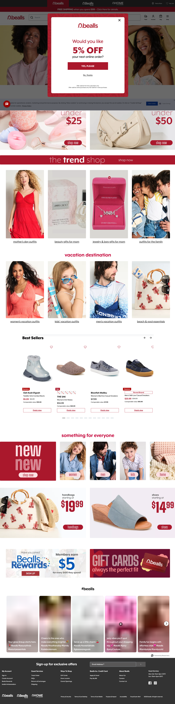
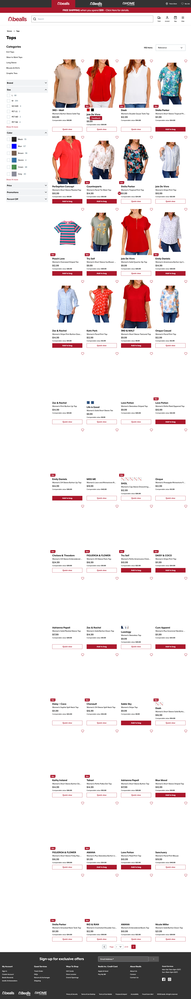
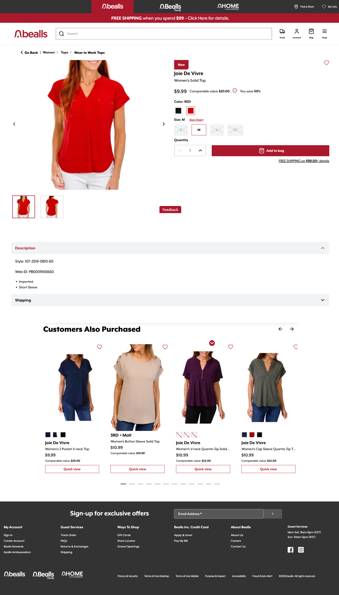

# Audit — bealls.com

**Captured**: 2026-04-30
**Viewport**: 1440×900
**Pages audited**: Homepage, PLP (Women / Tops), PDP (Joie De Vivre Women's Solid Top)

## Captures

-  — `screenshots/bealls/01-homepage.png`
-  — `screenshots/bealls/02-plp-women-tops.png`
-  — `screenshots/bealls/03-pdp-womens-top.png`

## Voice and visual identity at a glance

- **Color**: red (`#c41e3a`-ish) + black + white. Aggressive red. Off-price retail signal.
- **Typography**: friendly sans-serif headlines (likely a humanist sans like Mier or Gotham), all-lowercase wordmark, slightly playful display weights for promo callouts.
- **Density**: high. Promo strip + brand strip + utility nav stack three rows of chrome before content.
- **Promo grammar**: "FREE SHIPPING when you spend $99", "5% OFF your next online order" (email modal), "Members earn $5 for every $100 they spend" (Bealls Rewards). Off-price language: **"Comparable value $20.00 — You save 50%"**, not "regular price". This is a vocabulary commitment, not interchangeable with "was/now".
- **Personality**: family-oriented, value-oriented, broadly inclusive. Imagery shows real people (kids, families, couples) — not aspirational fashion editorial.

## Component patterns observed

### Page chrome (cross-cutting)

| Pattern | Notes |
|---|---|
| **Utility bar** (top) | Black strip with "Find a Store" / "My Lists". Persistent. |
| **Brand-strip nav** (3 tabs) | `bealls` / `Bealls Florida` / `HOME` — top-level multi-banner switcher. **This is unique to the Bealls family** and one of the most distinctive UI patterns. Tabbed selection, active tab is filled. |
| **Promo strip** (red) | "FREE SHIPPING when you spend $99 — Click Here for details." Persistent below brand strip. |
| **Header bar** | Logo + search + Track / Account / Bag / Shop icons. Standard. |
| **Footer** | Black, email signup left-anchored, multi-column links, repeated brand-strip at footer. |

### Homepage sections (top to bottom)

1. **Email-capture overlay modal** — "Would you like 5% OFF your next online order?" — fires on first visit. Modal-only; not a layout component, but worth modeling as a global capture pattern eventually.
2. **Lifestyle hero** — full-width photographic, two female models. No headline overlay observed (text minimal). Pure imagery.
3. **Price-tier tile pair** — two side-by-side photographic tiles: "under $25" and "under $50", each with "shop now" CTA. Bold price overlay on imagery. Maps to **`price-rail`** in our scope, but as a *2-up tile pair* not a horizontal scroll.
4. **The Trend Shop banner** — single thin row, "the trend shop" headline + "shop now" CTA. Maps to **`promo-strip`**.
5. **Themed category-tile-grid (4-up)** — "match day outfits / beauty gifts for mom / jewelry & long gifts for mom / outfits for the family" — four photographic tiles with caption labels. Maps to **`category-tile-grid`** with `columns: 4`.
6. **Vacation Destination row** — labeled section header "vacation destination" + 4 sub-category tiles (women's, kids', men's, beach pool essentials). Same `category-tile-grid` component, with a *labeled wrapper*.
7. **Best Sellers carousel** — section title, prev/next arrows, 4 product cards visible at a time. Has heart-save icons, sale badges, prices. **Maps to a NEW component: `product-carousel`** (we don't have this in Tier 1+2).
8. **Something for Everyone** — 5-up category tile row ("new / women / men / kids / home") — `category-tile-grid` with `columns: 5`.
9. **Lifestyle price hero pair** — two large photographic blocks, "handbags starting at $19.99" / "shoes starting at $14.99" with bold red price overlay and "shop now" CTA. **NEW component pattern: `lifestyle-price-hero`** — different from `hero-product` (single SKU) and `price-rail` (tiered tiles).
10. **Loyalty + Gift Cards split-promo pair** — Bealls Rewards on left, Gift Cards on right, two promo cards in a single row. Maps to a generic **`split-promo`** wrapper, OR could be two `promo-strip` instances side-by-side.
11. **Instagram-style social feed** — visible but blurred (lazy load issue). Worth noting; probably out of scope for v1.

### PLP patterns (Women / Tops)

| Pattern | Notes |
|---|---|
| **Left filter rail** | Persistent. Categories, Size, Color (with swatches), Price. Sticky on scroll. |
| **Sort dropdown** | Top right. |
| **Result count** + minor crumb | Compact. |
| **4-column product grid** | Square images, dense. Maps to existing `product-grid` `columns: 4` `imageRatio: square`. |
| **Per-card sale badge** | Red rectangular "SALE" badge top-left of image. **Worth a schema prop: `badge`.** |
| **Per-card price strikethrough** | Sale price prominent, comparable value struck through. |
| **Per-card "Add to bag" CTA** | Red filled button, full card width. Confirms `showQuickAdd: true` for hunter PLPs. |
| **Per-card heart-save** | Top-right of image. |
| **Lazy load** | Heavy — many cards below the fold render empty until scroll. |

### PDP patterns

| Pattern | Notes |
|---|---|
| **Breadcrumb** | "Go Back | Women / Tops / Wear to Work Tops" |
| **Image gallery** | Main + 2 thumbs + prev/next arrows. |
| **"New" badge** | Red rectangular, top-left of right column. |
| **Brand-as-line** | Brand "Joie De Vivre" on its own line *above* the product title. Not bundled into title. |
| **Pricing line** | "$9.99   Comparable value $20.00 (i)   You save 50%" — three signals on one line. The "(i)" is a tooltip explaining "Comparable value". |
| **Color swatches** | Small filled rectangles (BLACK / RED), selected state has red outline. |
| **Size picker** | 4 size cells; greyed cells show an "X" for unavailable sizes. **NEW PDP affordance worth noting.** |
| **Quantity stepper** | Standard. |
| **Add to bag CTA** | Full-width red. |
| **Free shipping micro-callout** | "FREE SHIPPING on $99.00+ details" — beneath CTA. |
| **Description accordion** | Open by default. Style code, Web ID, bullet points. |
| **Shipping accordion** | Closed by default. |
| **Customers Also Purchased carousel** | Section title + arrows + 4-card row + dot pagination. Each card has heart, mini color swatches, brand line, title, price, "Quick view" CTA (different from PLP's "Add to bag"). Confirms **`product-carousel`** as a real component. |

## Reconciliation against Tier 1 + 2 component scope

| Component (planned) | Confirmed by audit? | Notes |
|---|---|---|
| `promo-strip` | ✅ Strongly confirmed | Multiple instances on homepage + persistent shipping strip. |
| `category-tile-grid` | ✅ Strongly confirmed | At least 3 instances (4-up, 5-up, labeled-wrapper variant). Schema needs to support `columns: 4 | 5` and an optional section label. |
| `price-rail` | ⚠️ Partially confirmed | Bealls uses **2-up tile pairs** ("under $25 / under $50"), not horizontal scroll rails. Schema should support both modes, OR we rename and split: `price-tier-tiles` (2–4 tiles) + `price-rail` (scrolling row). |
| `editorial-lookbook` | ⚠️ Not on bealls.com | Likely lives on `beallsflorida.com` per hypothesis. Hold scope decision until that audit. |
| `bealls-bucks-callout` | ✅ Strongly confirmed | "Members earn $5 for every $100 they spend" + Bealls Rewards block on homepage. Confirmed loyalty grammar. |

## New components surfaced by the audit (NOT in frozen scope)

| Component | Use case | Estimated cost | Recommendation |
|---|---|---|---|
| **`product-carousel`** | Best Sellers, Customers Also Purchased. Horizontal scroll with arrows + dot pagination. Distinct from `product-grid` (static dense layout). | ~1 day (interactive scroll state) | **Add to Tier 1.** Critical for hunter PLPs and PDPs; without this, related products fall back to grid which loses the merchandising signal. |
| **`lifestyle-price-hero`** | Bealls's "handbags starting at $19.99" / "shoes starting at $14.99" lifestyle blocks — large image, bold price overlay, single CTA. | ~0.5 day | **Add to Tier 2.** A meaningful demo moment for gatherer/gifter. Cheap to build. |
| **`brand-strip-nav`** | Multi-banner switcher (bealls / Bealls Florida / HOME). | Out of layout scope — this is global page chrome, not an AI-generated section. | **Don't add to layout vocab.** Implement as a static brand chrome component in `Nav.svelte`, conditionally rendered when the active brand is a Bealls family banner. |
| **`split-promo`** | Loyalty + gift cards row (two promo cards side-by-side). | ~0.25 day | **Skip for v1.** Achievable as two adjacent `promo-strip` instances. Re-evaluate if AI struggles to compose them. |

## Cost adjustment

The frozen estimate budgeted **5 components in Phase 2 (~5 days human / ~1.5 days agent-assisted)**. The audit recommends:

- **Add `product-carousel` to Tier 1** (~1 day human / ~0.3 day agent-assisted)
- **Add `lifestyle-price-hero` to Tier 2** (~0.5 day human / ~0.15 day agent-assisted)
- **Adjust `price-rail` schema** to support 2-up tile mode (~0.25 day extra)

**Net Phase 2 adjustment**: +1.75 days human / +0.5 days agent-assisted. Per the dual-baseline discipline, **the frozen estimate stays frozen** — this delta is captured in the "What we added that wasn't in the plan" retro section. We're not changing the original number.

## Questions for the next two banners

1. Does `beallsflorida.com` actually have an editorial-lookbook pattern (multi-product styled compositions)? If not, drop that from Tier 2.
2. Does `homecentric.com` use `product-carousel` and `lifestyle-price-hero` similarly? If yes, the Tier 1 addition is justified for all three banners — not just bealls.com.
3. Is the brand-strip pattern present at the same priority on all three banners? (Likely yes, since they share the same parent navigation.)
