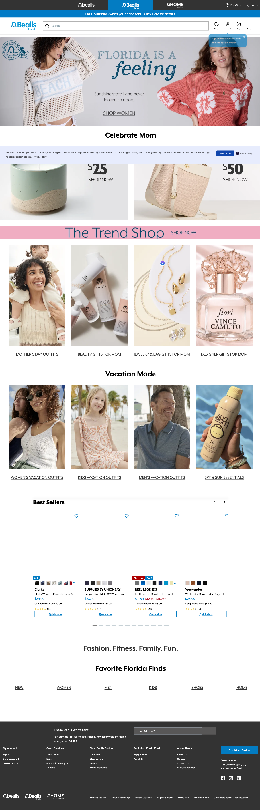
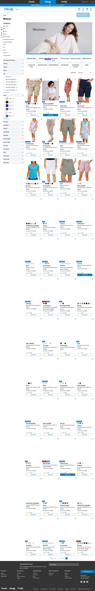
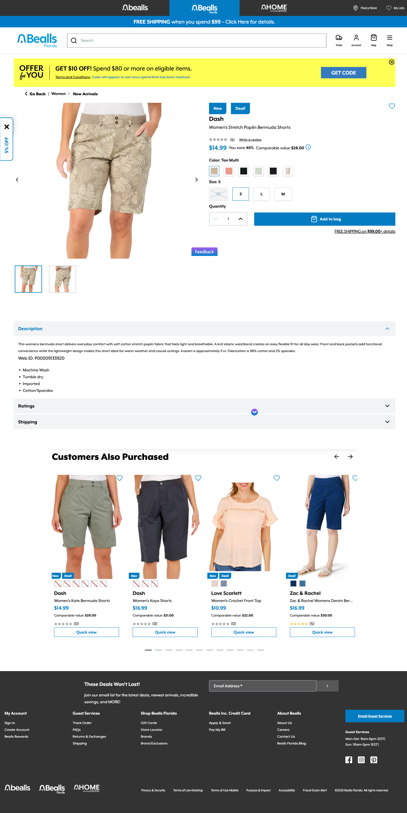

# Audit — beallsflorida.com

**Captured**: 2026-04-30
**Viewport**: 1440×900
**Pages audited**: Homepage, PLP (Women), PDP (Dash Women's Stretch Poplin Bermuda Shorts)

## Captures

-  — `screenshots/beallsflorida/01-homepage.png`
-  — `screenshots/beallsflorida/02-plp-women.png`
-  — `screenshots/beallsflorida/03-pdp-bermuda-shorts.png`

## Voice and visual identity at a glance

- **Color**: blue + teal (`#0066b3`-ish primary, `#00a3c4`-ish accent) + white. Coastal, not aggressive.
- **Typography**: serif/script blend in headlines (e.g., "FLORIDA IS A *feeling*" mixes a thick sans with a flowing italic script). Body is a clean sans.
- **Density**: lower than bealls.com. More whitespace, larger imagery, fewer competing CTAs above the fold.
- **Promo grammar**: same off-price vocabulary ("Comparable value", "Save 46%"), but framed more as a *destination shop* than a *value bin*. Hero says "Sunshine state living never looked so good!" — that's brand voice, not pitch.
- **Personality**: lifestyle / resort wear. Florida-as-mood. Imagery features sunshine, beach, palm trees, multi-generational. **The most editorial of the three banners.**

## Key deltas vs `bealls.com`

| Surface | bealls.com | beallsflorida.com |
|---|---|---|
| Primary color | Aggressive red | Coastal blue/teal |
| Hero treatment | Photographic, no overlay text | **Photographic with editorial text overlay** ("FLORIDA IS A *feeling*" + body + CTA) |
| Hero typography | Sans only | Mixed serif italic + sans |
| Email modal | 5% off offer fires on first visit | Not observed on first visit |
| PLP top section | Filters + grid (no hero) | **PLP hero banner with imagery + category title** |
| PLP grid density | 4-col square | **3-col, slightly larger cards** (more editorial) |
| Sub-category nav | Left filter rail only | **Horizontal text-link sub-nav above grid** + filter rail |
| Per-card swatch dots | Not visible (or subtle) | **Visible — color swatch dots on cards** |
| PDP review block | Less prominent | Star rating + "Write a review" up high |
| Coupon callout | Persistent shipping strip only | **Yellow personalized coupon strip** ("OFFER for YOU — Spend $80, get $10 off, GET CODE") above PDP |
| PDP badges | Single badge ("New") | **Multi-badge stacking** ("New" + "Deal") |

## New / refined component patterns surfaced by this audit

| Pattern | Observed where | Component implication |
|---|---|---|
| **Editorial hero with text overlay** | Homepage hero ("FLORIDA IS A feeling") | **Refines the `editorial-lookbook` hypothesis.** What we actually see is *editorial-hero-with-text-overlay*, not multi-product hotspots. Cheaper to build (~0.5 day vs 1.5 day). Consider renaming the planned component to `editorial-hero` with image + headline + body + CTA props. |
| **PLP hero banner** | PLP top, above grid | **NEW: extend `category-header` schema to optionally include a hero image.** This isn't a new component — just an optional `heroImage` prop on the existing `category-header`. ~0.25 day. |
| **Sub-category nav strip** | PLP, above grid | Could be a new `subcategory-nav` component (text-link row), or part of an extended `category-header`. The latter is cleaner — bundle it with the existing component. |
| **Personalized coupon strip** | Above PDP, banner-yellow | **NEW: `coupon-strip`** — distinct from persistent `promo-strip` because it's personalized/triggered (varies by shopper), brighter color, includes a code-reveal CTA. ~0.5 day. Loyalty-adjacent; pairs with `bealls-bucks-callout`. |
| **Multi-badge stacking** | PDP product card ("New" + "Deal") | **Schema update**: `badges: Array<{label, kind}>` instead of single `badge`. Trivial, ~0.1 day. |
| **Per-card swatch dots** | PLP cards | Already mentioned as deferred (`swatch-grid` Tier 3). Confirmed it's important on apparel-heavy banners. Tier 3 stays — render as a thumbnail-only proxy first; full swatch interactivity is a v2 ask. |
| **Per-card star rating** | Related-products carousel + PDP | **Schema addition** to `product-grid`/`product-carousel`: `showRating: boolean` and `rating + reviewCount` on the product summary sent to AI. ~0.25 day for the schema + render; 0 days for catalog (use BC review API). |

## Reconciliation against frozen scope

| Component (planned) | Confirmed on beallsflorida.com? | Notes |
|---|---|---|
| `promo-strip` | ✅ Confirmed | Plus a *new sibling*: `coupon-strip` (personalized variant). |
| `category-tile-grid` | ✅ Confirmed | Same patterns as bealls.com. |
| `price-rail` | ✅ Confirmed | Same 2-up tile pattern as bealls.com (under $25 / under $50). |
| `editorial-lookbook` | ⚠️ Refined | Actual pattern is `editorial-hero` with text overlay, not multi-product hotspots. **Recommend renaming + simplifying.** |
| `bealls-bucks-callout` | ✅ Confirmed | Pairs naturally with `coupon-strip`. |
| `product-carousel` (added in bealls.com audit) | ✅ Confirmed | Same Customers Also Purchased pattern, same arrows + dots. |
| `lifestyle-price-hero` (added in bealls.com audit) | ⚠️ Not observed on BF homepage | Either it's a bealls.com-only pattern, or we just didn't scroll far enough. Hold the Tier 2 add. |

## Cost adjustment for beallsflorida.com

Net-new from this audit:
- **`coupon-strip`** (~0.5 day human / ~0.15 day agent) — adds to Tier 1.
- **`category-header` schema extension** (hero image + sub-category nav) (~0.25 day) — extends existing component, not a new one.
- **Multi-badge stacking + per-card rating** schema additions (~0.25 day combined) — schema-only changes.
- **Rename + simplify `editorial-lookbook` → `editorial-hero`**: net savings of ~0.5–1 day vs the original plan because we drop the hotspot interactivity.

**Net delta vs frozen plan**: roughly flat. Coupon strip and rating fields *add* ~1 day; lookbook simplification *saves* ~1 day. Per the dual-baseline discipline, the frozen number doesn't move; the components on the actual list do.

## Brand-voice signal for Phase 3 (brand identity capture)

Phase 3 estimate stays at ~1 day per banner. For beallsflorida.com specifically:

- **Voice attributes**: warm, sun-drenched, lifestyle, multi-generational, casual confidence. Avoid: hard-sell vocabulary, urgency timers, comparison-shopping language.
- **Persona definitions** lean differently than bealls.com:
  - *Gatherer* = browsing for vacation/resort wear, beach lifestyle inspiration
  - *Hunter* = outfit-completion shopper ("matching shoes for this dress"), not deal-mining
  - *Researcher* = much weaker presence on this banner — apparel doesn't get spec-comparison-shopped
  - *Gifter* = shopping for the FL recipient (snowbird parents, retiree, relocating relative)
- **Voice guidance**: "Lead with the feeling, then the product. 'Sunshine state living' beats 'best-in-class shorts.' Earn the editorial right by being specific about the FL lifestyle, not generic about beach vibes."

## Questions deferred to homecentric.com audit

1. Does `homecentric.com` have an editorial hero, or is it pure category/price-driven (more like bealls.com)?
2. Does `lifestyle-price-hero` (bealls.com) appear on homecentric, or is it a bealls.com-specific pattern?
3. Is the `coupon-strip` pattern present across all three banners, or only beallsflorida?
