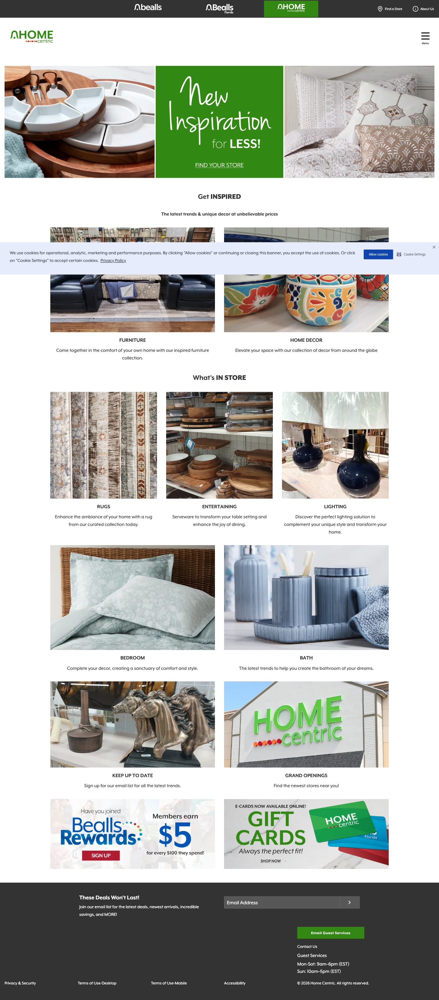

# Audit — homecentric.com

**Captured**: 2026-04-30
**Viewport**: 1440×900
**Pages audited**: Homepage. **No PLP / PDP exist on the live site** — see "Critical finding" below.

## Critical finding: HomeCentric is brick-and-mortar only

`homecentric.com` has zero e-commerce presence. Every category/product surface is a store-locator redirect:

- **Total links on homepage**: 31 (vs ~250+ on `bealls.com`).
- **Shop / category / product URLs**: 0.
- **All "FURNITURE", "LIGHTING", "RUGS", "GRAND OPENINGS" links** route to `stores.homecentric.com/search?...` — the store-locator, not a catalog.
- **No shopping cart icon, no "Add to bag", no PDP route.**
- **Header has only a hamburger Menu** — no search, no cart, no account icon (vs the dense utility chrome on the other two banners).
- **CTAs read "FIND YOUR STORE", "Find the newest stores near you!"** — driving foot traffic, not transactions.
- The footer email signup says "These Deals Won't Last!" — same body copy as `beallsflorida.com`, but with no online deals to back it up.

## Captures

-  — `screenshots/homecentric/01-homepage.png`
- **PLP**: not applicable (does not exist on live site)
- **PDP**: not applicable (does not exist on live site)

## Voice and visual identity at a glance

- **Color**: green (`#76b82a`-ish) + black + white. Off-price-home green, distinct from both red (bealls.com) and blue (beallsflorida.com).
- **Typography**: serif/script blend in headlines (e.g., "*New Inspiration* for LESS!" uses a flowing italic script). Body and category labels in clean sans, all-caps for category labels (FURNITURE, RUGS, LIGHTING).
- **Density**: lowest of the three banners by a wide margin. Generous whitespace. Single-column flow with full-width imagery between sections.
- **Promo grammar**: "Inspired Living for Less" is the through-line. **Less aggressive sale language than the other two banners** — no comparable-value strikethroughs (because there are no products to price), no doorbusters, no coupon codes.
- **Personality**: editorial home decor, sparser, confident-in-quality. Closer in tone to `Haven` (the existing Aisles reference brand) than to either Bealls banner.
- **Tagline**: "Inspired Living for Less" + "The latest trends & unique decor at unbelievable prices"

## Component patterns observed (homepage only)

| Pattern | Notes |
|---|---|
| **Brand-strip nav** (3 tabs) | Same `bealls / Bealls Florida / HOME` pattern, but the HOME tab is filled green to indicate active. Confirms cross-banner global chrome. |
| **Tri-image hero collage** | Three side-by-side photographic blocks; the middle block is a green text-only panel ("New Inspiration for LESS! — FIND YOUR STORE"). **NEW pattern**: `tri-image-hero` or `image-image-text-image` collage. ~0.5 day if we want to support it, but trivial as a static section. |
| **Section title with editorial framing** | "Get **INSPIRED**" + subtitle "The latest trends & unique decor at unbelievable prices". Bold treatment on a single word in the heading. |
| **2-up category tile with description** | Furniture / Home Decor — two large tiles with category label and *full sentence of body copy* underneath each. **More descriptive than the other banners' tiles.** Schema: extend `category-tile-grid` to support an optional `description` per tile. |
| **3-up category tile with description** | What's IN STORE — Rugs / Entertaining / Lighting, same pattern. |
| **2-up category tile with description** (recurring) | Bedroom / Bath. |
| **2-up info/promo tile pair** | Keep Up To Date (email signup) + Grand Openings (store locator). |
| **Bealls Rewards + Gift Cards split-promo** | Same row pattern as the other two banners. |
| **NO persistent shipping promo strip** | Because there's no shipping — they're not shipping anything. |
| **NO email-capture modal** observed | |

## Reconciliation against frozen scope

| Component (planned) | Confirmed on homecentric.com? | Notes |
|---|---|---|
| `promo-strip` | ⚠️ Limited use | No shipping strip; only the loyalty/gift-card row at the bottom. |
| `category-tile-grid` | ✅ Strongly confirmed | The dominant component on this homepage. **Schema needs an optional `description` per tile.** |
| `price-rail` | ❌ Not applicable | No prices on the live site. Will be needed on the synthesized PLP. |
| `editorial-lookbook` / `editorial-hero` | ⚠️ Partially | "Get INSPIRED" with section subtitle is editorial framing, but no full text-overlay hero like beallsflorida.com. |
| `bealls-bucks-callout` | ✅ Confirmed | Same row at the bottom of the page. |
| `product-carousel` | ❌ Not applicable | No products to carousel on the live site. Will be needed on synthesized PLP. |
| `lifestyle-price-hero` | ❌ Not applicable | No products. |
| `coupon-strip` | ❌ Not applicable | No e-commerce. |

## Implications for the engagement (this is the load-bearing section)

**The original plan assumed three live e-commerce sites to mirror.** That assumption is wrong for HomeCentric. There are three options for the engagement:

### Option A — Drop HomeCentric from the engagement (not recommended)

Reduce scope to two banners. **Loses a major sales angle**: HomeCentric is the most brand-distinctive of the three (different color, different voice, different positioning), and dropping it makes the demo about *replicating existing online stores* rather than *standing up agentic commerce*.

### Option B — Synthesize an e-commerce HomeCentric (recommended)

**This is the demo's strongest pitch.** Reframe the HomeCentric demo as: *"Your offline brand can be online — fully personalized, agentically — in days."* Concretely:

- **Catalog source**: scrape the home-related categories from `bealls.com` (rugs, bedding, bath, lighting, kitchen, entertaining, furniture if available). The Bealls family already shares supply chain — synthesizing HomeCentric's catalog from sister-banner inventory is defensible.
- **Brand identity**: take the HomeCentric homepage as canon (green, "Inspired Living for Less", sparse editorial). Apply this brand to the synthesized catalog.
- **Component scope**: HomeCentric's PLP and PDP can reuse the bealls.com PLP/PDP component patterns. **Zero net-new component work for HomeCentric beyond what bealls.com already requires.**
- **Demo narrative**: open by showing the live `homecentric.com` (no e-commerce, just a brand brochure with a store locator). Then switch to the Aisles-powered demo at `homecentric-aisles.demo.signal.x` with full personalization, Bealls Bucks integration, etc. The contrast is the pitch.

### Option C — Build HomeCentric as an in-store product-discovery tool

Reframe HomeCentric not as e-commerce but as in-store *product discovery* (kiosk / mobile companion app). Aisles powers the personalization layer. **Higher narrative risk** (no clear "buy" loop) and substantially more work to design the in-store UX. **Not recommended for v1.**

## Locked decision (revised 2026-04-30): Option D — content-mode platform capability

**Options A, B, C above are preserved for context.** The locked decision is a fourth option that emerged after stakeholder discussion: rather than synthesizing an online HomeCentric (Option B) or building an in-store companion (Option C), **extend Aisles itself to natively support two operating modes**, with HomeCentric as the content-mode anchor banner.

### Option D — Content-mode platform capability

| Mode | Banners | Personalization drives | CTAs |
|---|---|---|---|
| Storefront | bealls.com, beallsflorida.com | Product selection, pricing, cross-sell | Cart, PDP, checkout |
| **Content / locator** | **homecentric.com** | **Editorial framing, hero choice, category emphasis, lifestyle imagery** | **Store locator, newsletter, in-store-pickup interest** |

Same persona inference engine, same layout AI, same brand-config router — different downstream actions.

### Why this is the strongest path

- **Matches HomeCentric's real posture.** No implied fulfillment that the off-price treasure-hunt model can't deliver. No "is this a recommendation?" hedge needed.
- **Demonstrates platform breadth.** The same Aisles engine powers transactional and brand sites — a sharper pitch than three independent storefront clones.
- **Unlocks cross-banner persona continuity.** A gatherer on `homecentric.com` browses bedroom inspiration, switches to `bealls.com` via the brand strip, and sees bedding products on sale — same persona maintained, same engine. New showstopper demo moment.
- **Reusable platform capability.** The mode flag isn't bealls-engagement-specific; it applies to any future merchant that has both transactional and brand sites under one roof.

### What this changes in scope

**Removed**:
- HomeCentric catalog scrape (the bealls.com home-subset pull, ~1 day Phase 4 work)
- Operational-caveat language and supervision overhead
- Risk of accidentally implying fulfillment HomeCentric doesn't have

**Added** (platform extension, reusable):

| Work | Cost (human / agent) |
|---|---|
| `BrandConfig.mode: 'storefront' \| 'content'` flag | 0.1 d / 0.05 d |
| Mode-gated component vocabulary (Zod schema + prompt) — content mode excludes `product-carousel`, `hero-product`, `lifestyle-price-hero`, transactional `product-grid` props | 0.4 d / 0.15 d |
| Content-mode CTA routing (store locator, newsletter, RSVP intents) | 0.4 d / 0.15 d |
| Curated content items model — replaces catalog for content-mode brands (~12–20 hand-authored items per banner: store locations, brand pillars, categories, lifestyle scenes) | 0.5 d / 0.2 d |
| **Subtotal** | **~1.4 d / ~0.55 d** |

### Net effort vs Option B (synthesize-online)

| | Option B | **Option D (locked)** |
|---|---|---|
| HomeCentric catalog scrape | +1 d | 0 d |
| Platform mode capability | 0 d | +1.4 d |
| **Net delta vs Option B** | baseline | +0.4 d human / +0.1 d agent |

Roughly net-neutral on cost. **Substantially better demo value** and **respects HomeCentric's actual operational posture** without needing a hedging caveat.

### ADR

Captured as a permanent architectural decision: `docs/architecture/decisions/005-storefront-vs-content-modes.md`.

## Schema additions confirmed by this audit

- **`category-tile-grid`** schema needs an optional `description` field per tile (multiple banners use it; HomeCentric uses it heavily). ~0.1 day.
- **`tri-image-hero`** is a one-off pattern — defer; render as a static fallback on the HomeCentric homepage. Not worth a discrete component for one banner.

## Voice and persona signal for Phase 3

- **Voice attributes**: editorial, calm, confident, value-conscious. "Inspired" not "amazing". "Unique" not "exclusive". Lower urgency than the other two banners.
- **Persona definitions** lean home-specific:
  - *Gatherer* = browsing for room inspiration, decor moodboards
  - *Hunter* = practical replenishment ("new sheets, under $50")
  - *Researcher* = larger purchases (rugs, lighting fixtures) where dimensions and materials matter
  - *Gifter* = housewarming, registry adjacent — "something nice for someone's new place"

## Summary

| | bealls.com | beallsflorida.com | homecentric.com |
|---|---|---|---|
| Live e-commerce? | ✅ Full | ✅ Full | ❌ Brick-and-mortar only |
| Color | Red | Blue/teal | Green |
| Voice | Promotional, family | Editorial, coastal | Editorial, value home |
| Demo strategy | Mirror existing site | Mirror existing site | **Synthesize an online HomeCentric using sister-banner catalog** |
| Net-new components for this banner | (covered by lead banner) | `coupon-strip`, `editorial-hero` | None — reuses lead banner vocab |
| Catalog source | Scrape live `bealls.com` | Scrape live `beallsflorida.com` | **Subset of `bealls.com` home categories** |
